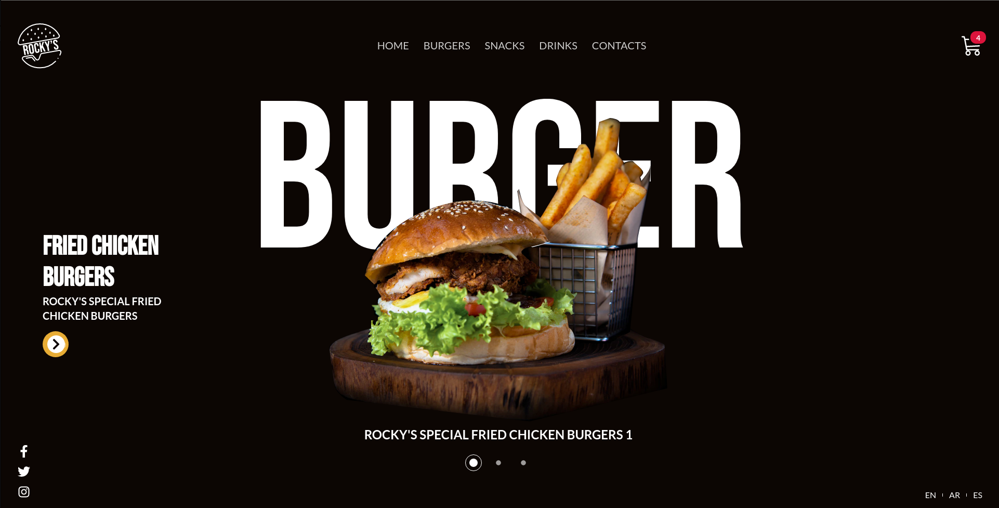

<h1 align="center">
  Reprodução do canal leovargasdev Live 02 Twitch: Rocky's Burger
</h1>
<!--
<h2 align="center">
  Travel to San Francisco Safely
</h2> -->


<p align="center">
  
</p>

## 💻 Projeto

Esse projeto foi desenvolvido durante uma live coding na [Twitch.tv](https://www.twitch.tv/leovargasdev).
O protótipo desse website foi desenvolvido pelo studio [**Orange Peel**](https://dribbble.com/OrangePeelStudiosUK), [clique aqui](https://dribbble.com/shots/14938812-Rocky-s-Burger-design) para abrir o protótipo no dribbble.

Dependências usadas no projeto:

-  [Next.js](https://nextjs.org/)
-  [Sass](https://sass-lang.com/)
-  [TypeScript](https://www.typescriptlang.org/)
-  [React Icons](https://react-icons.netlify.com/)

Também foi adicionado as ferramentas [**ESLint**](https://eslint.org/) e [**Prettier**](https://prettier.io/) para aumentar a produtividade e auxiliar a manter um padrão de código.

## 📥 Instalação e execução

Faça um clone desse repositório e acesse o diretório.

```bash
# Instalando as dependências
$ yarn

# Executanto aplicação
$ yarn next
```
